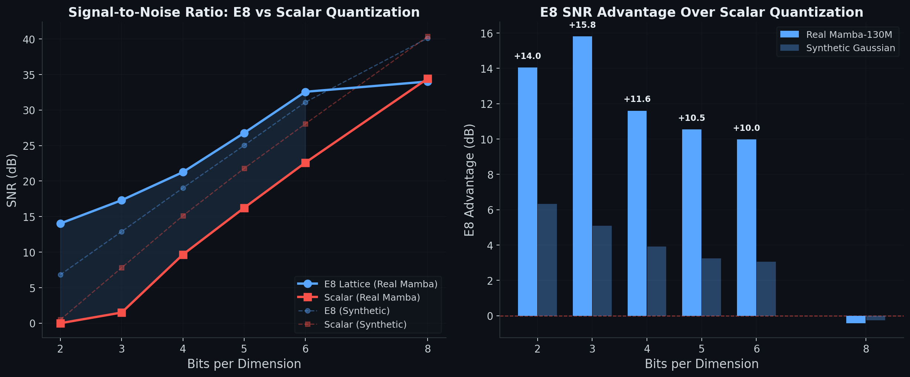

# E8 Lattice Quantization for SSM Hidden States

**Drop-in replacement for scalar quantization that delivers 10-15 dB better signal preservation on state space model hidden states at low bit rates.**

The E8 lattice — the densest sphere packing in 8 dimensions with 240 minimal vectors — is the provably optimal quantizer for 8D Gaussian sources. SSM hidden states (Mamba's fixed-size memory fingerprint) are a lossy compression problem. This repo applies E8 lattice geometry to that problem, reducing information loss at low bit rates where standard scalar quantization destroys signal.

## Key Results

Validated on **real Mamba-130M hidden states** captured during inference (RTX 5090, CUDA 12.8, seed 42):

| Bits/dim | E8 SNR (dB) | Scalar SNR (dB) | E8 Advantage | Verdict |
|:--------:|:-----------:|:---------------:|:------------:|:-------:|
| 2 | 14.04 | 0.00 | **+14.03 dB** | E8 wins |
| 3 | 17.31 | 1.50 | **+15.81 dB** | E8 wins |
| 4 | 21.26 | 9.66 | **+11.60 dB** | E8 wins |
| 5 | 26.77 | 16.23 | **+10.54 dB** | E8 wins |
| 6 | 32.57 | 22.59 | **+9.98 dB** | E8 wins |
| 8 | 34.01 | 34.43 | -0.42 dB | Crossover |

At 2-bit, scalar quantization produces **0.00 dB SNR** (complete signal destruction) while E8 preserves **14 dB of signal**. The crossover at 6-8 bits is consistent with information-theoretic predictions.

The real-model advantage is **~3x stronger** than synthetic Gaussian predictions, indicating that real Mamba states have structure (heavier tails, inter-dimensional correlations) that E8 geometry exploits and scalar quantization destroys.

## Why This Matters

Every existing Mamba quantization method — Quamba, Q-Mamba, QMamba, LightMamba, Quamba-SE — uses scalar quantization with increasingly elaborate workarounds (Hadamard transforms, rotation matrices, temporal grouping, decoupled scales) to fight outliers. They treat sub-8-bit hidden state quantization as nearly impossible:

- **QMamba** reports 62-66% accuracy drops at 4-bit with naive scalar quantization
- **Q-Mamba** achieves W8A8H4 (only hidden states at 4-bit) with ~2% accuracy loss
- **Quamba-SE** (Jan 2026, SOTA) achieves at best +0.83% over Quamba — at 8-bit

These methods are solving a geometry problem with arithmetic. E8 lattice quantization operates in 8D space where a single outlier dimension does not collapse the other seven — the lattice geometry absorbs it.

## How It Works

The E8 lattice is defined as:

    { x in R^8 : all coordinates integers OR all coordinates half-integers,
                 AND sum(coordinates) is even }

The quantizer uses the Conway-Sloane nearest-neighbour decoder:

1. Find closest point in the **integer coset** (D8): round to integers, fix parity
2. Find closest point in the **half-integer coset**: round to half-integers, fix parity
3. Return whichever coset point is closer to the input

**Zero violations** on 10,000 random samples — every output point satisfies E8 membership conditions.

## Implications

**Inference compression (validated).** Drop-in replacement on existing trained Mamba models. 4-bit E8 states instead of 16-bit scalar. 4x memory reduction on the state cache.

**Training with quantized states (theoretical).** E8-quantized states in the forward pass could maintain 4-bit precision where scalar requires 16-bit — enabling larger batch sizes or longer sequences in the same VRAM.

**Architectural compression (theoretical).** If E8 preserves more information per bit, equivalent information capacity can be achieved with smaller state dimensions or fewer bits — smaller models, same effective memory.

**Gaussianised SSM architecture (future).** Training SSM states with KL regularisation toward Gaussian distributions would make E8 provably optimal by construction.

## Usage

### Quick start (synthetic validation)

    python benchmark.py --seed 42

### Real Mamba-130M benchmark (requires GPU + CUDA)

    python -m venv e8env
    source e8env/bin/activate
    pip install torch --index-url https://download.pytorch.org/whl/cu128
    pip install transformers mamba-ssm causal-conv1d numpy sentencepiece protobuf
    python benchmark.py --real --seed 42

Note for Blackwell GPUs (RTX 5090/5080): Pre-built wheels may not include sm_120 kernels. You need CUDA toolkit 12.8+ and must rebuild from source:

    TORCH_CUDA_ARCH_LIST="12.0" pip install causal-conv1d mamba-ssm --no-binary causal-conv1d,mamba-ssm --no-cache-dir

### Use the quantizer directly

    from e8_quantizer import E8Quantizer
    import torch

    q = E8Quantizer()
    states = torch.randn(24, 64, 16)
    q.calibrate_scale(states, target_bits_per_dim=4)
    quantized = q.quantize(states)
    metrics = q.reconstruction_error(states, quantized)
    print(f"SNR: {metrics['snr_db']:.2f} dB")

## Files

| File | Description |
|------|-------------|
| e8_quantizer.py | E8 lattice quantizer with Conway-Sloane decoder |
| capture_states.py | PyTorch forward hooks to capture Mamba SSM hidden states |
| benchmark.py | Bit-rate sweep comparing E8 vs scalar quantization |
| benchmark_results.json | Raw results from the latest benchmark run |

## Roadmap

- [x] Synthetic validation
- [x] GitHub + license
- [x] Real Mamba-130M benchmark on Blackwell
- [x] README with real results + comparison plot
- [ ] arXiv technical note (2-4 pages)
- [ ] Compute partnership pitch
- [ ] Full Gaussianised SSM architecture with E8-native training

## Citation

    @software{e8_ssm_quantization,
      author = {Dwayne},
      title = {E8 Lattice Quantization for SSM Hidden States},
      year = {2026},
      url = {https://github.com/Dawizzer/e8-ssm-quantization}
    }

## License

Custom non-commercial license. Attribution required. Commercial use requires written agreement. See LICENSE for details.
